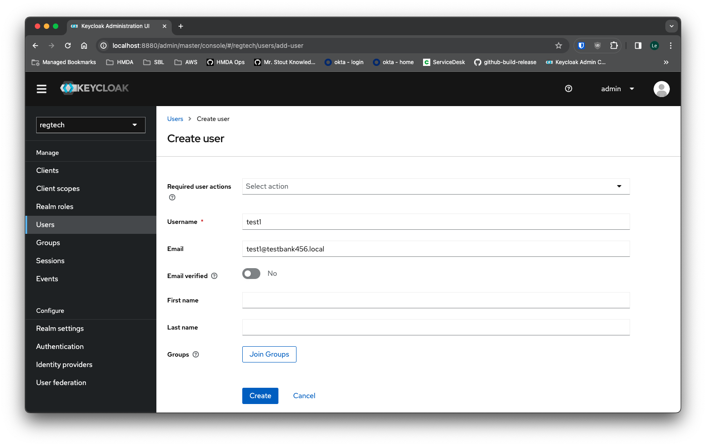

## Seeding mock data


### Prerequisite
* Have the docker compose local setup running, according to [LOCAL_DEV_COMPOSE](../../LOCAL_DEV_COMPOSE.md)
  * Running `docker compose build user_fi` would be beneficial to build a new image if you've previously ran the local setup before
  * May also be beneficial to refresh the setup's data by issuing `docker compose down -v` first
* Have `psql` cli installed: `brew install libpq`
  * you may also need to set the PATH to include the libpq directory: `export PATH=$PATH:$HOME/homebrew/opt/libpq/bin`
* Have `jq` cli installed: `brew install jq`
  * you may also need to set the PATH to include the homebrew directory: `export PATH=$PATH:$HOME/homebrew/bin`

### Create mock institutions
With the script below, 3 institutions will be created; you may reference the information shown in the json files [test_bank_123.json](test_bank_123.json), [test_bank_456.json](test_bank_456.json), and [test_sub_bank_456.json](test_sub_bank_456.json)
```bash
./create_institutions.sh
```
You may use one of the json files as a template and follow the `regtech-user-fi-management` repo's README's [functionalities](https://github.com/cfpb/regtech-user-fi-management/blob/main/README.md#functionalities) section to create your own institution. To create 1 institution from command line, you can follow below:

```bash
export RT_ACCESS_TOKEN=$(curl 'localhost:8880/realms/regtech/protocol/openid-connect/token' \
-X POST \
-H 'Content-Type: application/x-www-form-urlencoded' \
--data-urlencode 'username=admin1' \
--data-urlencode 'password=admin' \
--data-urlencode 'grant_type=password' \
--data-urlencode 'client_id=regtech-client' | jq -r '.access_token')

file=path_to_your_institution_json_file

curl localhost:8881/v1/institutions/ -X POST \
  -H "Authorization: Bearer ${RT_ACCESS_TOKEN}" \
  -H 'Content-Type: application/json' \
  --data-binary "@$file" | jq -r '.'
```
You will need to replace `path_to_your_institution_json_file` to the json file you've created, for example `file=test_bank_123.json`

To associate a domain to the institution, you can follow below:
```bash
export RT_ACCESS_TOKEN=$(curl 'localhost:8880/realms/regtech/protocol/openid-connect/token' \
-X POST \
-H 'Content-Type: application/x-www-form-urlencoded' \
--data-urlencode 'username=admin1' \
--data-urlencode 'password=admin' \
--data-urlencode 'grant_type=password' \
--data-urlencode 'client_id=regtech-client' | jq -r '.access_token')

lei=your_mock_institution_lei
domain=mock.domain

curl "localhost:8881/v1/institutions/$lei/domains" -X POST \
  -H "Authorization: Bearer ${RT_ACCESS_TOKEN}" \
  -H 'Content-Type: application/json' \
  -d "[{\"domain\": \"$domain\"}]" | jq -r '.'
```
Change `lei`, and `domain` to the appropriate values

__NOTE__: These instructions are scripts works with the user_fi app through the docker compose setup of port `8881`, if you run the app locally instead via the instructions through user_fi's [README](https://github.com/cfpb/regtech-user-fi-management/blob/main/README.md), please change the port numbers `8881` to `8888`

### Create users via Keycloak

To test the system, users would need to be created; and these reside within Keycloak; and to access Keycloak, go to the url `http://localhost:8880/` in a browser.


We can access the admin page by clicking the `Administration Console`, you can log in with `admin` user with `admin` as password.

Once logged in, you are created with the screen below:


Click the realm drop down menu on the top left, and change selection from `master` to `regtech`


Once the realm selection is done, click the `Users` tab from the left navigation panel


There should be some mock users already, but new users can be added by clicking the `Add user` button to bring up the new user form

The only fields that are needed here are the `Username`, and `Email`; the `Email` should match the domain of one of the institutions created using the [create_institutions.sh](create_institutions.sh) script. These would be `testbank123.local`, `testbank456.local`, and `testsubbank456.local`. The `First name`, `Last name`, and `Groups` fields should be done through the `Complete your user profile` story.

Once the user is created, select the new user, and go into the `Credentials` tab

Select `Set password`

Type in the new password, and set `Temporary` to `Off` for testing.


Once these are done, the new user can be used to test the system locally by logging into the front end.

**NOTE**: From the front end, when updates have been done to the user (i.e. finished updating names, and associations); the token needs to be refreshed before making additional subsequent requests to the APIs.